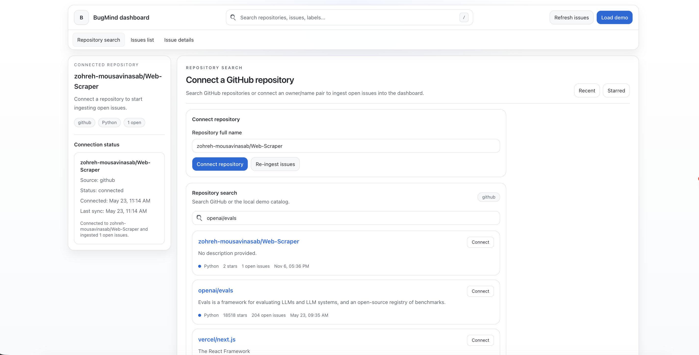
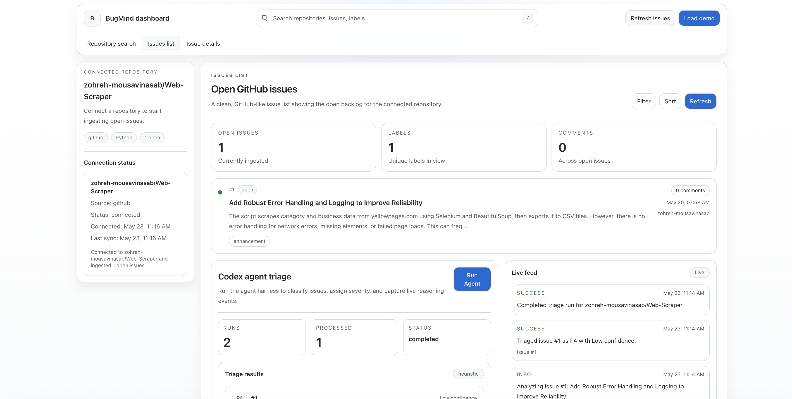
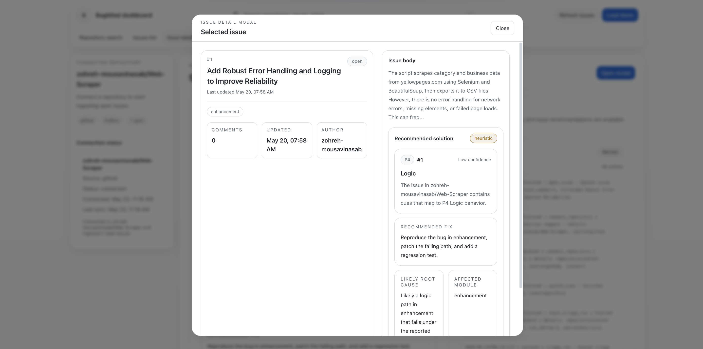
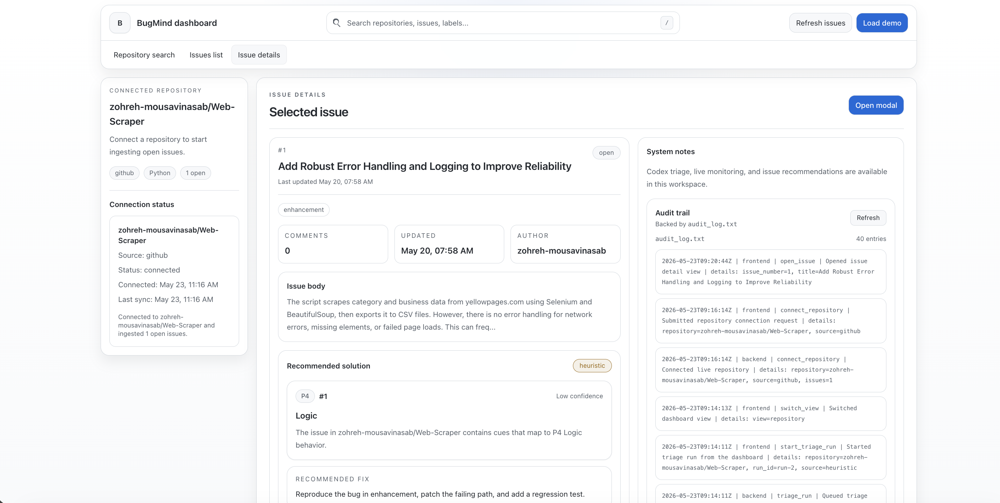

# BugMind

BugMind is an issue-triage assistant for GitHub repositories. It ingests open issues, surfaces them in a clean dashboard, and generates a structured triage recommendation so humans can review faster and make better decisions.

The current build is Phase 2: a FastAPI backend, a static frontend, live issue ingestion, heuristic triage, WebSocket event streaming, and local audit logging.

## Screenshots

| Repository search | Issues list |
| --- | --- |
|  |  |

| Issue details modal | Issue details and audit trail |
| --- | --- |
|  |  |

## What BugMind Does

- Connects to a GitHub repository and ingests open issues
- Shows repository, issue list, and issue detail views in a dashboard
- Runs a triage pass to estimate severity, bug type, root cause, and fix direction
- Streams triage activity live through WebSocket events
- Records actions in a local audit log for traceability
- Supports demo data when no GitHub token is available

## Current State

BugMind is working in a phased setup:

- Phase 1: repository connection and issue ingestion
- Phase 2: heuristic triage agent, live events, and dashboard experience
- Phase 3+: Codex CLI agent, approval flow, and GitHub write-back
- Phase 4+: PostgreSQL persistence and a React rewrite

## Tech Stack

- Backend: Python, FastAPI, Pydantic, Uvicorn
- Frontend: HTML, Tailwind CSS, vanilla JavaScript
- Data: in-memory store for the current phase
- Integrations: GitHub REST API, WebSocket streaming, local audit log

## Project Structure

```text
BugMind-AI/
├── backend/
│   ├── app/
│   ├── count_issues.py
│   ├── pyproject.toml
│   └── uv.lock
├── frontend/
│   ├── index.html
│   ├── main.js
│   ├── server.js
│   ├── styles.css
│   └── doc/
│       ├── pic1.jpg
│       ├── pic2.jpg
│       ├── pic3.jpg
│       └── pic4.jpg
├── playground/
├── INSTALL.md
└── README.md
```

## Prerequisites

- Python 3.11 or newer
- `uv`
- Node.js 18 or newer
- Git
- Optional: a GitHub personal access token in `.env`

## Local Setup

### 1. Clone the repository

```bash
git clone <your-repo-url>
cd BugMind-AI
```

### 2. Set up the backend

```bash
cd backend
uv venv
source .venv/bin/activate
uv sync
```

### 3. Start the backend API

```bash
uv run uvicorn app.main:app --reload --port 8000
```

The backend API will be available at `http://127.0.0.1:8000`.

### 4. Start the frontend

Open a second terminal:

```bash
cd frontend
node server.js
```

The dashboard will be available at `http://localhost:5173`.

## Environment Variables

Create a root `.env` file for local development:

```bash
GITHUB_TOKEN=your_github_token_here
BUGMIND_SOURCE=demo
FRONTEND_API_BASE=http://127.0.0.1:8000
```

If `GITHUB_TOKEN` is missing, BugMind falls back to demo mode.

## How to Use It

1. Open the dashboard in your browser.
2. Connect a GitHub repository or load the demo snapshot.
3. Ingest issues into the dashboard.
4. Run the triage agent on the selected repository or issue.
5. Review the recommendation, live events, and audit trail.

## API Overview

The backend exposes a small Phase 2 API surface:

- `GET /health`
- `GET /api/dashboard`
- `GET /api/search/repositories?q=query`
- `GET /api/issue-count?repo=owner/name`
- `POST /api/connect`
- `POST /api/ingest`
- `POST /api/triage/run`
- `GET /api/triage/runs`
- `GET /api/triage/events`
- `GET /api/issues/{number}/recommendation`
- `GET /api/audit/logs`
- `WS /ws/triage`

## Triage Output

For each issue, BugMind builds a structured recommendation with:

- Severity
- Bug type
- Affected module
- Root cause hypothesis
- Fix suggestion
- Confidence level

## Related Documentation

- [Installation guide](INSTALL.md)

## Roadmap

- AI-powered reasoning through Codex CLI
- Approval workflow before GitHub write-back
- PostgreSQL persistence
- React dashboard with richer triage interactions
- GitHub comments and labels for approved decisions

## Why This Project Exists

BugMind was built to reduce the time engineers spend reading, classifying, and routing bug reports. It demonstrates a practical AI-assisted workflow while keeping human review in the loop.

